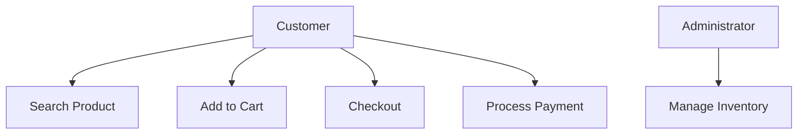
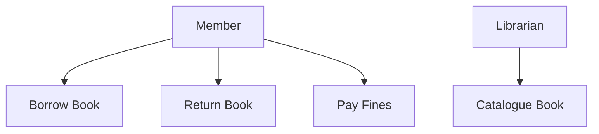

# Unified Modeling Language

## Introduction to Unified Modeling Language

The Unified Modeling Language (UML) stands as a cornerstone in the field of software engineering, known for its efficacy in modeling complex software systems. It is a standardized modeling language that provides a way to visualize a system's architectural blueprints, encompassing various types of diagrams and symbolic elements. To appreciate UML fully, it is essential to understand its evolution, its role in software engineering, and its fundamental components.

### The Evolution of UML
UML's journey began in the late 20th century, influenced by the need to consolidate a range of modeling methodologies that had emerged over the years.

1. **Early Modeling Methods**: Prior to UML, software engineering saw a variety of modeling methods, such as Entity-Relationship Diagrams (ERDs), used in database design, and flowcharts, which were common for algorithm representation. Other methods, like Booch method, Object-modeling Technique (OMT), and Object-oriented Software Engineering (OOSE), focused specifically on object-oriented design.

2. **The Convergence to UML**: The diversity in these methods often led to confusion and inefficiency, especially in large-scale and complex projects. Recognizing this, Grady Booch, Ivar Jacobson, and James Rumbaugh, known as the "Three Amigos," collaborated in the 1990s to integrate their respective methodologies (Booch method, OMT, and OOSE) into a unified approach. This effort culminated in the birth of UML, which was later adopted as a standard by the Object Management Group (OMG) in 1997.

### Importance of UML in Software Engineering
UML has become indispensable in the software development process, primarily due to its ability to aid in the visualization and documentation of software systems.

1. **Visual Representation**: UML's graphical nature makes it easier for developers to understand, design, and document complex software systems. It provides a visual language to represent the system architecture, workflows, data structures, and more, making it easier to communicate ideas and spot potential issues.

2. **Standardization**: As a standardized language, UML offers a consistent way of modeling systems, which is crucial for collaboration in large teams and across different organizations. This standardization ensures that UML diagrams are interpretable by anyone familiar with the language, irrespective of the specific tools used to create them.

### Overview of UML Components
At its core, UML is composed of diagrams and elements, each serving specific purposes in the modeling process.

1. **Diagrams**: UML includes several types of diagrams, each designed for modeling different aspects of a system. These include:

   - **Structural Diagrams**: Such as Class Diagrams, Object Diagrams, and Component Diagrams, which focus on the static aspects of the system.
   - **Behavioral Diagrams**: Including Use Case Diagrams, Sequence Diagrams, and Activity Diagrams, which depict the dynamic behavior of the system.
   - **Interaction Diagrams**: Like Sequence Diagrams and Communication Diagrams, which show how objects interact in particular scenarios.

2. **Elements**: The building blocks of UML diagrams include a variety of elements such as:

   - **Classes and Objects**: Representing entities with attributes and operations.
   - **Relationships**: Including associations, dependencies, generalizations, and realizations.
   - **Artifacts**: Representing physical components like files, documents, etc.
   - **Activities**: Denoting the workflow or processes.

In conclusion, UML serves as a universal language in software engineering, bridging gaps between conceptualization and implementation. Its comprehensive set of diagrams and elements provides a robust framework for effectively visualizing, designing, and documenting software systems, making it an essential skill for software professionals.

## UML Basics

Understanding the basics of the Unified Modeling Language (UML) is essential for anyone involved in software development. This foundational knowledge not only aids in visualizing the structure and design of a system but also enhances communication among team members. Here, we delve into the fundamentals of UML, including its diagrams, elements, symbols, notations, and the setup of UML tools.

### Understanding UML Diagrams
UML diagrams are categorized into two main types: Structural and Behavioral.

1. **Structural Diagrams**: These diagrams represent the static aspects of a system. Key structural diagrams include:
   - **Class Diagrams**: Show classes and their relationships.
   - **Object Diagrams**: Depict object instances of classes.
   - **Component Diagrams**: Illustrate the organization and dependencies among a set of components.
   - **Composite Structure Diagrams**: Detail the internal structure of classes.
   - **Deployment Diagrams**: Focus on the physical deployment of artifacts on nodes.
   - **Package Diagrams**: Display how a system is divided into packages.

2. **Behavioral Diagrams**: These diagrams model the dynamic behavior of the system and its objects. They include:
   - **Use Case Diagrams**: Represent the functionality provided by the system.
   - **Sequence Diagrams**: Show object interactions arranged in a time sequence.
   - **Activity Diagrams**: Depict the workflow from one activity to another.
   - **State Machine Diagrams**: Model the states and transitions of an entity.
   - **Communication Diagrams**: Focus on the interaction between objects.

### Basic Elements of UML
UML diagrams are composed of several basic elements:

1. **Classes and Objects**: Represent real-world entities with their attributes (properties) and operations (methods).
2. **Relationships**: Include various types like association, dependency, generalization, and aggregation, defining how elements are connected.
3. **Interfaces and Components**: Define system components and their interactions.
4. **Actors and Use Cases**: Specify system roles and functions.

### Symbols
Each UML diagram type utilizes specific symbols to represent various elements:

- **Classes**: Rectangles divided into compartments for name, attributes, and operations.
- **Interfaces**: Circles or lollipops.
- **Relationships**: Lines, arrows, and diamonds to denote associations, inheritances, or dependencies.
- **Actors**: Stick figures in use case diagrams.

### Notations
UML notations are a set of standardized rules to depict the information in diagrams:

- **Visibility Symbols**: Like + (public), - (private), and # (protected).
- **Multiplicity Notations**: Indicating the number of instances, like 1, *, 1..*.
- **Annotations**: Notes and constraints attached to elements.

### Setting Up UML Tools
UML diagrams can be created using various software tools, each offering different features.

1. **Software Options**:
   - **Enterprise-Level Tools**: Like Sparx Systems Enterprise Architect, offering advanced modeling capabilities.
   - **Open-Source Tools**: Such as StarUML or ArgoUML, which are free to use.
   - **Online Tools**: Including Lucidchart and Creately, providing cloud-based modeling solutions.

2. **Basic Setup Guide**:
   - **Choose a Tool**: Select a UML tool that suits your project's needs and budget.
   - **Installation**: For desktop applications, download and install the software. For online tools, create an account.
   - **Familiarization**: Get acquainted with the tool's interface and features.
   - **Template Selection**: Many tools offer templates for different UML diagrams.
   - **Creating Diagrams**: Start with simple diagrams like class or use case diagrams to get comfortable with the tool.
   - **Collaboration**: Explore features for sharing and collaborating on diagrams with team members.

In summary, grasping the basics of UML involves understanding its various diagrams, learning the symbols and notations used, and getting comfortable with a suitable UML tool. This foundational knowledge is crucial for effective software design and communication within development teams.

## Use Case Diagrams

Use Case Diagrams are a fundamental part of the Unified Modeling Language (UML) and play a critical role in the early stages of software development. They provide a user-oriented visualization of system functionality, making them crucial for understanding system requirements.

### Concept and Importance
- **Concept**: A Use Case Diagram is a graphical representation of the interactions between the users (actors) and the system to achieve specific goals. It focuses on the behavior of the system from an external point of view.
- **Importance**: These diagrams are essential because they:
   - **Facilitate Communication**: They provide a simple and intuitive way for stakeholders, including non-technical individuals, to engage in the system design process.
   - **Clarify Requirements**: Help in understanding and documenting functional requirements.
   - **Identify Actors and Use Cases**: Highlight all the users and the various ways they interact with the system.

### Elements of Use Case Diagrams
1. **Actors**: Represent users or external systems that interact with the system. Depicted as stick figures.
2. **Use Cases**: Illustrated as ovals, they represent the functions or services provided by the system.
3. **System Boundary**: A rectangle that frames the use cases, representing the scope of the system.
4. **Associations**: Lines connecting actors to use cases, showing interactions.
5. **Include and Extend Relationships**: Optionally used to show relationships between use cases, such as common functionalities or extensions.

### Creating a Use Case Diagram: Step-by-Step Guide
1. **Identify Actors**: Start by identifying all external entities that will interact with the system. These could be users, other systems, or hardware devices.
2. **Identify Use Cases**: List out all the functionalities or services that the system should provide to the actors.
3. **Draw the System Boundary**: Represent the system with a rectangle and place all identified use cases within this boundary.
4. **Connect Actors to Use Cases**: Use lines to connect each actor to the relevant use cases they interact with.
5. **Add Relationships (if necessary)**: Include 'include' or 'extend' relationships between use cases to represent shared functionalities or optional extensions.
6. **Refine and Review**: Ensure that the diagram represents all user interactions and review it with stakeholders for completeness and accuracy.

### Examples

### Online Shopping System
- Actors: Customer, Administrator.
- Use Cases: Search Product, Add to Cart, Checkout, Process Payment, Manage Inventory (for Admin).
- Associations: Lines connecting the Customer to the first four use cases and the Administrator to 'Manage Inventory'.

### Library Management System
- Actors: Member, Librarian.
- Use Cases: Borrow Book, Return Book, Catalogue Book (Librarian), Pay Fines (Member).
- Associations: Member connected to Borrow, Return, and Pay Fines; Librarian to Catalogue Book.

Use Case Diagrams are invaluable for ensuring a mutual understanding of system functionalities between developers and stakeholders. They serve as a foundation for more detailed system design and are integral in the planning phases of a software project.

## Class Diagrams

Class Diagrams are a central aspect of the Unified Modeling Language (UML), offering a static view of a system. They are instrumental in object-oriented analysis and design, providing a blueprint for the application's structure.

### Understanding Class Diagrams
- **Purpose**: Class Diagrams represent the classes within a system and the relationships between them. They are used for visualizing, specifying, and documenting the system's structure and design.
- **Key Aspect**: Unlike Use Case Diagrams that focus on the system's functionality from an external viewpoint, Class Diagrams offer an internal view, detailing how the system is constructed.

### Components of Class Diagrams
Class Diagrams consist of several components that depict the system's structure:

1. **Classes**: A class is depicted as a rectangle divided into three parts:
   - **Top Section**: Contains the class name.
   - **Middle Section**: Lists the attributes or properties of the class.
   - **Bottom Section**: Contains the operations or methods the class can perform.

2. **Relationships**: There are various types of relationships in Class Diagrams:
   - **Association**: A basic relationship that represents a connection between classes, usually depicted with a line.
   - **Aggregation**: A special form of association representing a "whole-part" relationship, indicated with an empty diamond at the whole's end.
   - **Composition**: A stronger form of aggregation, represented with a filled diamond, implying ownership.
   - **Inheritance (Generalization)**: Indicates an "is-a" relationship, represented with an arrow pointing from the derived class to the base class.
   - **Dependency**: A weaker relationship, depicted with a dashed line, indicating that a class depends on another class.
   - **Realization**: Shows that a class (usually an interface) is realized by another class, depicted with a dashed line and an open arrowhead.

### Advanced Class Diagram Techniques
Class Diagrams can be enhanced with several advanced techniques to provide a more detailed view of the system:

1. **Interfaces**: Represented as a circle or a class with the stereotype "«interface»", interfaces define a contract that implementing classes must fulfill.
2. **Multiplicity Notations**: Indicates the number of instances in a relationship, such as 1..*, 0..1, etc.
3. **Visibility**: Marking attributes and operations with visibility symbols like + (public), - (private), # (protected), and ~ (package).
4. **Attributes and Operations Specification**: Detailed specification of properties and methods, including data types and parameters.
5. **Constraint Notations**: Adding constraints and conditions to relationships or classes.
6. **Template Classes (Generics)**: Representing parameterized classes with a dashed box.
7. **Association Classes**: A class that is linked to an association, providing additional attributes and operations for the association.

Class Diagrams are a powerful tool in software development, providing a clear and structured way of visualizing the system's architecture. They play a critical role in the design phase, guiding the development process and ensuring that the system's structure is well-defined and coherent. By utilizing advanced techniques, class diagrams can become even more informative, capturing the intricacies and nuances of complex systems.

## Sequence Diagrams

Sequence diagrams are a dynamic modeling tool within the Unified Modeling Language (UML) toolkit, primarily used to detail the interactions and order of operations within a system.

### Sequence Diagram Fundamentals
- **Purpose**: Sequence diagrams are primarily focused on depicting the sequence of messages exchanged between various objects in a system to accomplish a specific functionality or process.
- **Time Aspect**: They emphasize the time sequence of messages, where time progresses as you go down the diagram. This makes them ideal for visualizing dynamic behavior, particularly the flow of messages in complex scenarios.

### Constructing Sequence Diagrams
Creating a sequence diagram involves several key steps and elements:

1. **Identify Actors/Objects**: Start by identifying the actors (external entities) and the objects (instances of classes) that interact in the scenario.
2. **Lifelines**: Represent each actor or object with a lifeline, a dashed vertical line that shows the object's existence over time.
3. **Activation Bars**: Vertical rectangles on a lifeline, known as activation bars, indicate the time period an object is performing a task.
4. **Messages**: Depicted as arrows, messages represent communication between objects. The direction of the arrow shows the flow of the message from sender to receiver.
5. **Return Messages**: Optionally, dotted arrows can be used to represent the response from the receiver back to the sender.
6. **Creation and Destruction**: Special symbols can indicate the creation of a new instance or the destruction of an instance.

### Advanced Concepts in Sequence Diagrams
To model more complex interactions, sequence diagrams offer advanced concepts:

1. **Alternative Fragments (Alt)**: Used to represent conditional flows in a sequence, like if-else conditions.
2. **Loop Fragments**: Indicate repetitive sequences or loops, with a guard condition defining the loop's continuation.
3. **Parallel Fragments (Par)**: Show parallel flows of control, where operations occur concurrently.
4. **Synchronous vs. Asynchronous Messages**: Distinguished in diagrams, synchronous messages wait for a response before continuing, while asynchronous messages do not.
5. **Time Constraints**: Indicate specific timing requirements or constraints for message passing.
6. **Interaction References**: Reuse of another sequence diagram within a larger sequence, useful for reducing complexity.
7. **Frame and Operand**: The frame encloses a sequence diagram, and operands are used within fragments to define conditions.

Sequence diagrams are particularly valuable in the detailed planning phases of software development, where understanding the interaction between various system components is crucial. They provide a clear visualization of message flow and are essential in scenarios where timing and order of operations are critical. By incorporating advanced concepts, sequence diagrams can effectively represent complex logic and parallel processes, making them a versatile tool in the UML suite.

## Activity Diagrams

Activity diagrams, a part of the Unified Modeling Language (UML), offer a dynamic view of a system, focusing on the workflow or the sequence of activities.

### Basics of Activity Diagrams
- **Purpose**: Activity diagrams are used to model the flow of control or data from one activity to another. They are particularly useful in visualizing the dynamic aspects of a system, such as business processes, workflows, or complex algorithms.
- **Flow of Control**: Unlike sequence diagrams that focus on object interactions, activity diagrams emphasize the flow of control and can show parallel processes.

### Developing Activity Diagrams
Creating an activity diagram involves understanding and representing the flow of activities in a system:

1. **Start and End Nodes**: Every activity diagram has a start node (a filled circle) and an end node (a circle with a filled circle inside it).
2. **Activities**: Represented as rounded rectangles, activities are the tasks or functions performed by the system or process.
3. **Transitions**: Arrows or lines connecting activities, representing the flow from one activity to the next.
4. **Decision Nodes**: Diamond shapes that depict a point where a decision is made, leading to different paths based on the condition.
5. **Merge Nodes**: Used to bring together multiple flows into a single forward flow.
6. **Fork and Join Nodes**: Represent parallel processing. A fork creates concurrent tasks, while a join synchronizes parallel flows.
7. **Swimlanes**: Partition the diagram into lanes, often representing different organizational units or actors, to show who or what is responsible for each activity.

### Complex Scenarios in Activity Diagrams
For more intricate systems, activity diagrams can incorporate several advanced elements:

1. **Nested Activities**: Activities can be decomposed into finer-grained activities for detailed modeling.
2. **Signal Sending and Receiving**: Represent asynchronous communication between activities or processes.
3. **Time Events**: Show activities or events triggered after a certain period.
4. **Exceptions and Interrupts**: Model exception handling or interruptions in the flow of activities.
5. **Loop Nodes**: Indicate a repeating sequence of activities, often with a setup for initialization and a condition for continuation.
6. **Conditional Flows**: Use conditions on transitions to guide the flow based on specific criteria.
7. **Preconditions and Postconditions**: Define what must be true before and after an activity is performed.

Activity diagrams are versatile tools in UML, suitable for modeling various aspects of system behavior. They are particularly effective in scenarios where the sequence and conditions of operations are complex, and multiple parallel processes exist. These diagrams help in understanding the overall flow of activities, making them indispensable for both system designers and developers.

## State Machine Diagrams

State Machine Diagrams, also known as State Diagrams, are an integral component of the Unified Modeling Language (UML) used to model the dynamic behavior of a system. These diagrams are particularly effective in depicting the lifecycle of an object, showing how an object responds to various events by changing its state.

### Introduction to State Machine Diagrams
- **Purpose**: State Machine Diagrams are used to model the states that an object can be in and the transitions between these states. They are particularly useful for systems with complex logic and behavior that depends on internal conditions or the history of events.
- **Key Concept**: The primary focus is on an object's states, the events that trigger state changes (transitions), and the actions that result from state changes.

### Building State Machine Diagrams
Creating a State Machine Diagram involves several key steps:

1. **Identify States**: Start by identifying the different states in which the object can exist. States are represented as rounded rectangles and usually reflect conditions or modes of an object.
2. **Initial and Final States**: Mark the start (initial state) of the object's lifecycle with a filled circle and the end (final state) with a circle with a dot inside.
3. **Transitions**: Use arrows to represent transitions from one state to another. These are triggered by events.
4. **Events**: Specify events that cause transitions. Events can be internal or external actions or occurrences.
5. **Actions**: Optionally, define actions that occur on entering or exiting a state or during the transition.
6. **Guard Conditions**: These are boolean expressions that must be true for a transition to occur.

### Advanced State Modeling
To represent more complex behaviors, State Machine Diagrams can include advanced modeling concepts:

1. **Nested States (Substates)**: States can contain substates, allowing for the representation of more detailed behaviors.
2. **Concurrent States**: Use regions divided by dashed lines within a state to represent parallel states or activities.
3. **Entry and Exit Actions**: Specify actions that are automatically triggered when entering or exiting a state.
4. **Internal Transitions**: Represent transitions that occur within a state, often in response to events, without causing the state to change.
5. **Time Events and Time Guards**: Model transitions or actions that occur after a certain time or within specific time constraints.
6. **History States**: Capture and restore the previous state of an object, useful in complex systems with many states.
7. **Choice Points**: Represent decision-making within the state machine, where the next state depends on certain conditions.

State Machine Diagrams are particularly valuable in scenarios where an object's state influences its behavior. They provide a clear visual representation of an object's lifecycle, making them essential for designing and understanding systems with complex state-dependent behaviors. These diagrams are commonly used in real-time systems, embedded systems, and various applications where the state of objects is a critical aspect of functionality.

## Component Diagrams

Component Diagrams are a structural diagram in the Unified Modeling Language (UML) used to visualize the organization and relationships of various components within a system. They are crucial in representing the physical aspects of object-oriented software systems.

### Component Diagram Overview
- **Purpose**: Component Diagrams illustrate the physical components (or parts) of a system, their organization, and interconnections. These components include software modules, libraries, files, executables, or other units of composition.
- **Focus**: Unlike Class Diagrams that focus on the logical aspect of a system, Component Diagrams emphasize the physical aspect and how software components are wired together to form larger systems or software packages.

### Creating Component Diagrams
To develop a Component Diagram, the following steps are typically involved:

1. **Identify Components**: Begin by identifying the major software components of the system. Components can be represented as rectangles with two small rectangles jutting out from the left side.
2. **Interfaces**: Define the interfaces that each component provides or requires from other components. Interfaces are often depicted as lollipops (circle on a stick) for provided interfaces and half-circles or sockets for required interfaces.
3. **Connections**: Use arrows to represent the connections or dependencies between components. These can show which interfaces are used by which components.
4. **Packages**: Optionally, organize components into packages to simplify the diagram and show higher-level organization.
5. **Annotations**: Include notes or comments to provide additional information about components or connections.

### Advanced Component Modeling
Component Diagrams can incorporate advanced concepts for more complex systems:

1. **Ports**: Use ports to specify the interaction points between a component and its environment or between components.
2. **Composite Components**: Represent components that are made up of smaller components. This is useful for showing a hierarchical structure.
3. **Delegation Connectors**: Illustrate how internal parts of a composite component delegate responsibilities to one another.
4. **Parameterized Components**: Use for components that are instantiated with different parameters.
5. **Realizations and Dependencies**: Show how components realize interfaces or depend on other components or interfaces.
6. **Deployment Artifacts**: Include artifacts to represent the physical implementation of components, like executables or files.
7. **Component Instances**: In more detailed diagrams, show instances of components, especially when modeling runtime scenarios.

Component Diagrams are essential in the design and understanding of complex software systems, especially those with many interacting parts. They provide a clear view of how a system is physically structured and how its constituent parts are expected to interact, making them invaluable for system architects and developers. These diagrams are particularly useful in modular and service-oriented architectures, where understanding the relationships and dependencies between components is critical.

## Deployment Diagrams

Deployment Diagrams in the Unified Modeling Language (UML) are crucial for modeling the physical aspects of a system, particularly focusing on how software components are deployed on hardware infrastructure.

### Understanding Deployment Diagrams
- **Purpose**: These diagrams are used to visualize the physical deployment of artifacts (like software components, libraries, or executables) on nodes (physical hardware or virtualized platforms).
- **Key Aspects**: Deployment Diagrams help in understanding how hardware and software interact, the physical distribution of components, and the system's runtime configuration.

### Constructing Deployment Diagrams
Creating a Deployment Diagram involves several key elements and steps:

1. **Identify Nodes**: Nodes represent the physical or virtual hardware elements in the system, like servers, computers, or devices. They are depicted as three-dimensional boxes.
2. **Identify Artifacts**: Artifacts are the tangible software items that will be deployed on the nodes. They can include web applications, databases, software components, etc., and are often represented as rectangles.
3. **Deployment**: Show how artifacts are allocated to nodes. This is depicted with an association line between an artifact and a node.
4. **Node Configuration**: Indicate the configuration or properties of the nodes, such as memory size, CPU capacity, or the operating system.
5. **Communication Paths**: Represent the pathways for communication between nodes, such as LAN, WAN, or internet connections, depicted as solid lines between nodes.
6. **Annotations**: Add notes for additional context or explanations about the deployment setup.

### Complex Deployment Scenarios
For more intricate systems, Deployment Diagrams can include advanced elements:

1. **Nested Nodes**: Show that one node is contained or hosted within another node, like a virtual machine within a physical server.
2. **Component Allocation**: Besides artifacts, you can also show how specific components from a Component Diagram are deployed on the nodes.
3. **Load Balancing and Clustering**: Indicate configurations for load balancing and clustering of nodes for high availability and scalability.
4. **Network Configurations**: Detailed representation of network infrastructure, including routers, firewalls, and other networking devices.
5. **Scaling Strategies**: Illustrate horizontal and vertical scaling strategies for cloud deployments or distributed systems.
6. **Replication and Redundancy**: Show how data or services are replicated across different nodes for redundancy and fault tolerance.
7. **Versioning Information**: Include details about the versions of deployed artifacts, especially important in systems with continuous integration and deployment.

Deployment Diagrams are particularly valuable for system administrators, developers, and architects, providing a clear visualization of how software components are distributed across a system's hardware infrastructure. They are essential in planning and ensuring efficient, reliable, and scalable system deployments, especially in complex and distributed environments like cloud computing platforms.

## Object Diagrams

Object Diagrams in Unified Modeling Language (UML) provide a snapshot of the instances in a system at a specific moment. They are essentially the instance-level counterparts of Class Diagrams, focusing on object instances and their relationships.

### Object Diagram Basics
- **Purpose**: Object Diagrams are used to visualize the practical application of class diagrams. They show how objects interact and relate to each other in a particular scenario, reflecting the system's state at a specific point in time.
- **Key Aspects**: These diagrams depict objects (instances of classes), their attributes with specific values, and relationships (links) between them.

### Creating Object Diagrams
To construct an Object Diagram, follow these steps:

1. **Identify Objects**: Determine the instances of classes (objects) that are relevant to the scenario being modeled. Objects are represented similarly to classes but with underlined names and specific attribute values. The format is usually `ObjectName: ClassName`.
2. **Attribute Values**: Specify the value of each attribute for the objects. These values represent the state of the object at the time the diagram is depicting.
3. **Links**: Draw links (lines) between objects to represent relationships or associations that exist in the specific context. These are the instance-level analogs of associations in class diagrams.
4. **Role Names**: If necessary, label the links with role names to clarify the nature of the relationship between objects.
5. **Multiplicity**: Indicate the multiplicity at each end of the association, which shows how many instances of one object class are related to one instance of another object class.

### Advanced Object Diagram Techniques
For more detailed modeling, several advanced techniques can be used:

1. **Object Composition**: Illustrate the composition relationships between objects, showing part-whole hierarchies at the instance level.
2. **Dynamic Instances**: Represent objects that are created or destroyed dynamically during the scenario.
3. **Link Attributes**: Sometimes, a link itself can have attributes, especially when the association it represents in the class diagram has attributes.
4. **Inheritance and Polymorphism**: Show instances of subclasses and how polymorphism affects the object's interactions.
5. **Aggregate Objects**: Depict aggregate objects, which are objects that consist of other objects.
6. **Constraint Representation**: Include constraints that apply to specific objects or links, showing restrictions or conditions in the object relationships.
7. **Interface Realizations**: Display how objects realize or implement interfaces at runtime.

Object Diagrams are particularly useful in understanding and validating the design of a system, especially in terms of object interactions and relationships. They provide a concrete visualization of abstract class diagrams, offering insights into the system's real-world instantiation and behavior. These diagrams are often used in conjunction with sequence diagrams to trace the evolution of object states over time in different scenarios.

## Composite Structure Diagrams

Composite Structure Diagrams in Unified Modeling Language (UML) are specialized diagrams used for visualizing the internal structure of a class and the interactions between its parts at a more granular level.

### Basics of Composite Structure Diagrams
- **Purpose**: These diagrams are designed to show the internal composition of a class, focusing on the collaboration between internal parts to realize the overall behavior of the class.
- **Key Aspects**: Composite Structure Diagrams illustrate the organization of internal structures, including parts, ports, connectors, and the arrangement of interconnected components.

### Developing Composite Structures
To create a Composite Structure Diagram, follow these key steps:

1. **Identify Class or Component**: Start with the class or component whose internal structure is being modeled.
2. **Define Parts**: Break down the class into its constituent parts. These parts are typically instances of other classes and represent the internal components of the class.
3. **Ports**: Define ports on the parts or the class itself. Ports are interaction points that specify the services that a part provides or requires.
4. **Connectors**: Use connectors to show the relationships and interactions between the parts. Connectors can link parts directly or via their ports.
5. **Collaborations**: Identify collaborations, which are sets of roles and relationships needed to accomplish a specific function or behavior.
6. **Roles and Interfaces**: Assign roles to the parts and define interfaces for the ports, specifying the expected interactions.
7. **Constraints and Comments**: Optionally, add constraints or comments to provide additional information or rules governing the structure.

### Advanced Composite Structures
For more complex modeling, several advanced elements can be incorporated:

1. **Nested Compositions**: Represent compositions within compositions to detail multi-level internal structures.
2. **Dynamic Compositions**: Show how the internal structure might change dynamically at runtime.
3. **Collaboration Uses**: Model the use of specific collaborations by the composite structure, detailing the roles played by the parts.
4. **Delegation Connectors**: Illustrate how external interactions are delegated to internal parts through ports.
5. **Multiplicity**: Specify the number of instances for parts and connectors to represent scalable or repetitive structures.
6. **Behavioral Features**: Incorporate behavioral aspects such as state machines or activities to represent the dynamic behavior of parts.
7. **Parameterized Structures**: Use parameterization for generic composite structures that can be instantiated with different types or values.

Composite Structure Diagrams are essential in the detailed design phase of object-oriented software development, especially for complex classes or components with intricate internal interactions. They provide a powerful means to understand and manage the complexity of software systems by visualizing the interplay of their internal parts. These diagrams are particularly useful in component-based development and systems that require a clear representation of internal collaborations and interactions.

## Package Diagrams

Package Diagrams in Unified Modeling Language (UML) are used to organize and manage the elements of a system into related groups, enhancing the system's scalability and maintainability.

### Introduction to Package Diagrams
- **Purpose**: Package Diagrams provide a way to group elements such as classes, interfaces, components, and other diagrams into packages. A package is a namespace that organizes and encapsulates these elements, typically to control their visibility and reusability.
- **Key Aspects**: These diagrams are crucial for large systems where managing complexity and maintaining a clear structure are essential. They help in understanding the dependencies and relationships between different parts of the system.

### Constructing Package Diagrams
To develop a Package Diagram, follow these fundamental steps:

1. **Identify Packages**: Determine the packages that will be part of the system. A package can contain various UML elements and even other packages.
2. **Package Representation**: Represent each package as a tabbed folder or a rectangle with the package name at the top.
3. **Containment**: Place elements (like classes, interfaces, or other diagrams) inside their respective packages. This shows which elements belong to which package.
4. **Dependencies**: Draw dependency arrows between packages to show how one package depends on another. This could be due to the use of types or interfaces defined in another package.
5. **Visibility**: Optionally, indicate the visibility of elements within packages, such as public or private.
6. **Annotations**: Add notes or comments for additional explanations or context about packages or their relationships.

### Advanced Packaging Techniques
For more complex systems, Package Diagrams can incorporate advanced elements and techniques:

1. **Nested Packages**: Represent packages within packages, useful for showing a hierarchical organization.
2. **Import and Access**: Differentiate between import (bringing in elements from another package) and access (referring to public elements of another package) relationships.
3. **Merge and Extend**: Show how one package extends or merges with another package, often used in frameworks and libraries.
4. **Stereotypes and Constraints**: Use stereotypes to specify the nature of the package or constraints to define rules that apply to the package.
5. **Package Interfaces**: Define interfaces provided or required by a package, illustrating the service contracts between packages.
6. **Parameterized Packages**: Represent packages that can be parameterized with different types or values, similar to templates in programming.
7. **Versioning**: Include version information for packages, especially important in systems with multiple releases or variants.

Package Diagrams are a strategic tool in managing large-scale software projects, providing a high-level view of a system's structure. They facilitate the modular development of systems and help in managing dependencies, promoting better organization, and easier maintainability of complex systems. These diagrams are especially useful for architects and developers in understanding the overall layout and dependencies of the system's components.

## Profile Diagrams

Profile Diagrams are a specialized type of diagram in the Unified Modeling Language (UML) used for extending the UML standard to create new model elements, making it possible to tailor UML for different domains and platforms.

### Understanding Profile Diagrams
- **Purpose**: Profile Diagrams allow for the customization of UML by defining stereotypes, tagged values, and constraints. These customizations enable the application of UML to specific domains (like web development, aerospace, healthcare, etc.) or platforms (like .NET, Java EE).
- **Key Aspects**: These diagrams are particularly useful when the standard UML vocabulary and rules are insufficient for expressing certain domain-specific concepts or constraints.

### Creating Profile Diagrams
To develop a Profile Diagram, follow these key steps:

1. **Define Profile**: A profile in UML is essentially a package. Begin by defining a profile (using a package stereotype) that will contain the extensions.
2. **Stereotypes**: Create stereotypes to extend existing UML metaclasses (like Class, Component, etc.). A stereotype is represented as a class with the stereotype «stereotype».
3. **Tagged Values**: Define tagged values (properties) for stereotypes. These are additional attributes that can be attached to model elements when a stereotype is applied.
4. **Constraints**: Specify constraints using the Object Constraint Language (OCL) or natural language. Constraints are rules that must be followed by the model elements to which the stereotype is applied.
5. **Apply Stereotypes**: Show how these stereotypes can be applied to specific UML elements. This step often includes examples of extended elements alongside the stereotype definitions.

### Advanced Profiling
For more comprehensive and specialized profiling needs, consider these advanced techniques:

1. **Extending Multiple Metaclasses**: Create stereotypes that extend more than one UML metaclass, enabling more complex customizations.
2. **Enumeration Types for Tagged Values**: Use enumerations to define a set of allowable values for a tagged value.
3. **Composite Stereotypes**: Define stereotypes that are composed of other stereotypes, allowing for layered or hierarchical customizations.
4. **Dependency Stereotypes**: Create stereotypes for dependencies, to extend the semantics of how elements relate to each other.
5. **Profile Diagram Refinement**: Iteratively refine the profile diagram, ensuring that it accurately captures all necessary domain-specific or platform-specific elements.
6. **Model Libraries**: Develop model libraries alongside profiles, providing reusable sets of model elements that conform to the defined stereotypes and constraints.
7. **Integration with Other Diagrams**: Use the defined stereotypes and constraints in conjunction with other UML diagrams, demonstrating their application in various contexts.

Profile Diagrams are essential tools for adapting UML to specific application domains or technological platforms. By enabling the definition of custom extensions, they ensure that UML remains a versatile and powerful modeling language, capable of accurately representing a wide range of systems and domains. These diagrams are particularly valuable for domain experts and system architects who need to express concepts that go beyond standard UML capabilities.

## Interaction Overview Diagrams

Interaction Overview Diagrams are an advanced type of diagram in Unified Modeling Language (UML), combining elements of Activity Diagrams and Sequence Diagrams. They offer a high-level view of the flow of control where nodes can contain other interaction diagrams.

### Basics of Interaction Overview
- **Purpose**: The main aim of Interaction Overview Diagrams is to provide an overview of how different interaction diagrams (like Sequence, Communication, or other Interaction diagrams) are related to each other and work together in a system.
- **Key Aspects**: These diagrams focus on the flow of control and data across various interaction diagrams, depicting a sequence of interactions or the coordination between different parts of a system.

### Diagram Development
Creating an Interaction Overview Diagram involves a few key steps:

1. **Identify Interactions**: Start by identifying the different interaction diagrams that are part of the process or system being modeled. Each interaction can be a complex sequence or communication diagram.
2. **Control Flow Nodes**: Similar to Activity Diagrams, use control flow nodes (like decision nodes, merge nodes, fork nodes, and join nodes) to guide the flow from one interaction to another.
3. **Interaction References**: These are the primary components of the diagram. Represent each interaction by a frame with a pentagon symbol, containing the name of the interaction. Inside the frame, you can either provide a brief description or a condensed version of the interaction diagram.
4. **Sequence Flow**: Connect these interaction references using arrows to show the sequence of interactions, depicting how the control flows from one to another.
5. **Conditional Flow**: Just like in activity diagrams, use decision and merge nodes to model conditional flows where the process may diverge based on certain conditions.

### Complex Interactions
To model more intricate systems, Interaction Overview Diagrams can incorporate advanced concepts:

1. **Parallel Flows**: Use fork and join nodes to represent parallel flows where multiple interactions can occur simultaneously.
2. **Loops and Iterations**: Represent repetitive processes or loops within the interaction flow, often using additional notation to indicate the loop condition.
3. **Nested Interactions**: Show interactions that are nested within other interactions, offering a more detailed view of certain parts of the process.
4. **Time Constraints and Events**: Include time constraints or events that trigger transitions between interactions.
5. **Alternate Paths**: Model alternate paths within the interaction flow, particularly useful for representing different scenarios or exception handling.

Interaction Overview Diagrams are powerful tools in UML for providing a bird’s-eye view of complex interactions in a system. They are particularly useful in large-scale systems where understanding the overall coordination between different parts is crucial. By combining elements of sequence and activity diagrams, they allow designers and developers to trace the flow of control and data at a higher level of abstraction, which is invaluable for ensuring coherent and efficient interactions within the system.

## Timing Diagrams

Timing Diagrams are a specialized type of diagram in Unified Modeling Language (UML) used to visualize the behavior of objects throughout a given period. These diagrams are particularly effective in scenarios where the timing of interactions is critical.

### Timing Diagram Fundamentals
- **Purpose**: The primary aim of Timing Diagrams is to represent the state of an object or interaction over time. They are used to understand the changes in state or condition of an object in response to external or internal events.
- **Key Aspects**: Unlike Sequence Diagrams, which focus on the sequence of messages, Timing Diagrams emphasize the timing and duration of states or conditions.

### Creating Timing Diagrams
To develop a Timing Diagram, follow these steps:

1. **Identify Objects and Events**: Start by determining the objects or interactions you wish to analyze and the significant events that affect them.
2. **Lifelines and Time Axis**: Draw a lifeline for each object or interaction. The lifeline is typically a horizontal or vertical line, with time represented along one axis (usually the x-axis for horizontal diagrams and the y-axis for vertical diagrams).
3. **States**: Mark the different states of the object along its lifeline. These can be represented by different segments along the line.
4. **Transitions**: Indicate transitions between states. Transitions correspond to events that cause a change in the state.
5. **Duration Constraints**: Where necessary, annotate the duration of specific states or the time between events.

### Advanced Timing Analysis
For more complex systems, advanced concepts can be incorporated into Timing Diagrams:

1. **Multiple Objects**: Analyze the timing relationships between multiple objects, showing how their states or conditions change in parallel.
2. **Nested States**: Represent states that are nested within other states, which is useful for showing different modes or conditions of an object.
3. **Conditional Changes**: Indicate state changes that depend on specific conditions or events.
4. **Synchronization**: Show synchronization points where multiple objects reach a certain state or condition simultaneously.
5. **Time Constraints and Events**: Model time-related constraints or events that affect the state of objects.
6. **Quantitative Timing**: Include quantitative measures of time, such as specific durations, frequencies, or delays, for more precise timing analysis.
7. **Combined with Sequence Diagrams**: Integrate Timing Diagrams with Sequence Diagrams to provide a more comprehensive view of the timing and sequence of events.

Timing Diagrams are particularly valuable in real-time systems, embedded systems, and other scenarios where the timing of operations is critical. They provide clear insights into the temporal aspects of object behavior, which is crucial for ensuring system reliability and performance. These diagrams are used extensively in system design, testing, and analysis to verify that timing requirements are met and to identify potential timing-related issues.

## UML and Software Development Processes

The Unified Modeling Language (UML) is a versatile tool adaptable to various software development methodologies, from traditional approaches like Waterfall to more contemporary methods like Agile and DevOps.

### UML in Agile Development
- **Adaptability**: Agile development emphasizes adaptability and incremental progress. UML, in this context, is used more flexibly. Diagrams are often simpler and more focused on immediate tasks.
- **Iterative Design**: UML diagrams are updated iteratively in Agile projects, evolving as the system develops through successive sprints or iterations.
- **Collaboration and Communication**: In Agile teams, UML is used as a communication tool to help team members and stakeholders visualize and understand system design and behavior.
- **Use Case and User Story Linkage**: UML diagrams, particularly Use Case Diagrams, can be effectively used to elaborate on user stories, providing a clearer picture of system interactions.
- **Minimal Documentation**: Agile favors working software over comprehensive documentation. UML diagrams used in Agile are typically less detailed, focusing only on what is necessary for understanding and communication.

### UML in Waterfall Model
- **Comprehensive Modeling**: The Waterfall model, with its sequential phases, allows for extensive use of UML at different stages. Detailed UML diagrams are created during the design phase and often remain unchanged throughout the development process.
- **Documentation**: UML plays a key role in creating comprehensive documentation, which is a hallmark of the Waterfall model.
- **Different Types of Diagrams**: Various UML diagrams are utilized to cover the system's breadth and depth, from structural (like Class Diagrams) to behavioral aspects (like Sequence and Activity Diagrams).
- **Forward and Reverse Engineering**: UML is often used for both forward engineering (designing the system before coding) and reverse engineering (creating diagrams from an existing system) in Waterfall projects.

### UML in DevOps
- **Bridging Development and Operations**: In DevOps, UML aids in bridging the gap between development and operations by providing clear and standardized documentation of systems.
- **Automation and Modeling**: UML can be integrated into automated processes for continuous integration and deployment. For instance, generating code from UML models.
- **Feedback Loop Integration**: DevOps emphasizes rapid feedback and continuous improvement. UML diagrams are used to quickly communicate changes and updates in the system among team members.
- **Monitoring and Operations**: Deployment Diagrams and Component Diagrams are particularly useful in DevOps for planning and monitoring the deployment process.

In summary, UML's application varies significantly across different software development processes. In Agile, it is used in a more lightweight and flexible manner, focusing on communication and iterative design. In the Waterfall model, UML is employed more extensively for thorough documentation and detailed system design. In DevOps, UML bridges the development and operations gap, aiding in automation and effective communication. The adaptability of UML to different methodologies underlines its utility and effectiveness in diverse software development contexts.

## UML Tools and Software

Unified Modeling Language (UML) tools and software are essential for creating, managing, and visualizing UML diagrams. These tools range from simple drawing applications to complex software that integrates with development environments.

### Overview of UML Tools
- **Purpose**: UML tools are designed to assist in the creation and interpretation of UML diagrams. They provide graphical interfaces for drawing and organizing various UML diagram types, including Class, Sequence, Use Case, Activity, and others.
- **Features**: Common features include drag-and-drop interfaces, template libraries, syntax checking, collaboration capabilities, and sometimes code generation or reverse engineering functionalities.
- **Types of Tools**:
   - **Standalone Applications**: Dedicated UML modeling applications.
   - **IDE Integrations**: Plugins or extensions for Integrated Development Environments (IDEs) that support UML diagramming.
   - **Online Tools**: Web-based UML tools offering cloud-based collaboration.

### Comparison of UML Software
Several UML tools are available, each with its unique set of features and capabilities. Here are some considerations for comparison:

1. **Ease of Use**: How user-friendly is the interface? Does it support drag-and-drop functionality?
2. **Feature Set**: What kinds of diagrams does it support? Does it offer advanced features like code generation or reverse engineering?
3. **Integration with Development Tools**: Does the tool integrate smoothly with popular IDEs or version control systems?
4. **Collaboration Features**: Does the tool support collaborative editing or versioning for teams?
5. **Cost**: Is the tool free, or does it require a subscription or a one-time purchase?
6. **Platform Compatibility**: Is the tool available for various operating systems, or is it web-based?
7. **Community and Support**: Is there active community support or professional support available for the tool?

Popular tools include Microsoft Visio (for general diagramming with UML capabilities), Lucidchart (a versatile online diagramming tool), Sparx Systems Enterprise Architect (a comprehensive UML tool), and StarUML or ArgoUML (open-source options).

### Integrating UML Tools in Development
Incorporating UML tools into the software development process involves several strategies:

1. **During Design Phase**: Use UML tools for initial system design, creating diagrams that provide a blueprint for the development.
2. **Code Generation**: Some advanced UML tools can generate skeleton code from diagrams, which can then be fleshed out by developers.
3. **Documentation**: Use UML diagrams for both internal documentation and external communication with stakeholders.
4. **Agile Environments**: In Agile teams, UML tools can be used for sprint planning and to visualize user stories or system iterations.
5. **Version Control Integration**: Store UML diagrams in version control systems alongside code to keep track of changes and maintain consistency.
6. **Review and Feedback Loops**: Use UML diagrams during code reviews or feedback sessions to help explain complex system behaviors or architectures.
7. **Training and Onboarding**: Leverage UML diagrams for training new team members, providing a clear overview of the system's architecture and functionality.

Integrating UML tools effectively into the development process can enhance understanding, communication, and productivity within software development teams. It bridges the gap between conceptual design and practical implementation, making complex systems more comprehensible and manageable.

## Best Practices in UML

Unified Modeling Language (UML) is a powerful tool for software design and documentation. To maximize its benefits, it's essential to follow best practices in UML modeling, avoid common pitfalls, and use UML as an effective communication tool.

### UML Modeling Standards
1. **Consistency**: Ensure that the use of symbols, notations, and diagram types is consistent throughout the project. Consistency makes the diagrams easier to understand and maintain.
2. **Simplicity**: Start with simple diagrams and gradually add detail. Overly complex diagrams can be difficult to understand and maintain.
3. **Use Standard UML Conventions**: Adhere to standard UML conventions for notations and symbols. This ensures that anyone familiar with UML can understand your diagrams.
4. **Tailor to Audience**: Customize the level of detail and the types of diagrams according to the needs and understanding of the audience (developers, stakeholders, managers).
5. **Update Regularly**: Keep UML diagrams up-to-date with the current state of the project. Outdated diagrams can lead to confusion and errors.

### Avoiding Common Pitfalls
1. **Over-Modeling**: Avoid creating too many unnecessary details in the early stages of design. Focus on key elements first.
2. **Ignoring Real-World Constraints**: Ensure that UML models are feasible and consider real-world constraints like technology limitations and business rules.
3. **Inconsistency with Code**: UML models should be in sync with the actual code. Discrepancies can cause miscommunication between team members.
4. **Not Using UML Where Appropriate**: Recognize situations where UML diagrams can provide clarity and efficiency, such as complex algorithm design or system architecture visualization.
5. **Neglecting Non-Technical Stakeholders**: Remember that not all stakeholders are technical experts. Simplify diagrams or use additional explanations where necessary.

### Effective Communication with UML
1. **Clarity and Precision**: Ensure that each diagram is clear and precise in what it aims to convey. Avoid ambiguity in representation.
2. **Relevance**: Choose the right type of UML diagram for the aspect of the system you are trying to communicate about.
3. **Integration with Documentation**: Integrate UML diagrams with other project documentation to provide a comprehensive view of the system.
4. **Feedback and Collaboration**: Use UML diagrams as a collaborative tool, encouraging feedback and discussion among team members.
5. **Training and Familiarization**: Ensure that all team members are adequately trained or familiarized with UML. This enhances the effectiveness of communication.
6. **Presentations and Reviews**: Use UML diagrams in presentations and reviews to succinctly communicate complex system designs or changes.

By following these best practices, UML can be a highly effective tool in the software development process, enhancing clarity, reducing misunderstandings, and improving collaboration within teams. It bridges the gap between conceptual design and practical implementation, making complex software systems more comprehensible and manageable.

## Advanced UML Topics

Unified Modeling Language (UML) is not just a tool for basic software design; it extends into more advanced areas, adapting to evolving technologies and methodologies. Some of these advanced topics include UML extensions, its application in Model-Driven Architecture (MDA), and its use in emerging technologies.

### UML Extensions
- **Purpose**: UML extensions, primarily in the form of stereotypes, tagged values, and constraints, allow for the customization of UML to suit specific needs or domains.
- **Profiles and Stereotypes**: Profiles are UML extensions that introduce new elements (stereotypes) to standard UML diagrams, tailored for specific domains or platforms. For instance, a profile might be created for web development, embedded systems, or cloud computing.
- **Tagged Values and Constraints**: These provide additional information about UML elements and define rules that the elements must follow, enhancing the expressiveness of UML models.
- **Custom Notations**: Advanced usage of UML might include developing custom notations to better represent specific concepts in a given domain.

### UML and Model-Driven Architecture
- **MDA Concepts**: Model-Driven Architecture is a software design approach that focuses on creating and exploiting domain models. In MDA, UML is used to create a Platform Independent Model (PIM) which is then transformed into a Platform Specific Model (PSM).
- **Transformation**: Tools are used to automatically transform UML models into executable code, bridging the gap between design and implementation.
- **Round-Trip Engineering**: This refers to the ability to synchronize models with code, enabling changes in either to be reflected in the other. It’s a key aspect of using UML in MDA, ensuring consistency between model and implementation.

### UML in Emerging Technologies
- **Internet of Things (IoT)**: UML can be used to model the complex interactions and architectures in IoT systems, such as device interactions, data flows, and control mechanisms.
- **Artificial Intelligence and Machine Learning**: UML diagrams can visualize data structures, workflows, and architectures in AI systems, though adapting UML to the dynamic nature of AI can be challenging.
- **Cloud Computing**: UML is suitable for designing cloud architectures, representing components like cloud services, resource allocation, and deployment models.
- **Microservices Architecture**: UML can be applied to model the services, their interactions, and the dynamic nature of microservices-based systems.

In advanced applications, UML becomes more than just a tool for static diagrams; it evolves into a framework for understanding, designing, and implementing complex systems in various domains. The ability to extend and adapt UML to different technological areas and methodologies underscores its versatility and enduring relevance in the field of software engineering.

## Case Studies and Real-World Examples

Case studies and real-world examples play a crucial role in understanding the practical application of Unified Modeling Language (UML) in various contexts. They provide insights into how UML is used in actual projects, the challenges encountered, and the lessons learned.

### Case Study Analysis
- **In-Depth Examination**: Case studies involve an in-depth examination of UML's application in a specific project or scenario. This includes analyzing the types of UML diagrams used, how they were integrated into the development process, and the outcomes.
- **Problem-Solving**: A key aspect is understanding how UML helped in solving particular problems, such as clarifying requirements, designing system architecture, or communicating among diverse teams.
- **Contextual Factors**: It's important to consider the context in which UML was used, such as the industry, the size and nature of the project, and the specific challenges faced.

### UML in Large Scale Projects
- **System Complexity**: In large scale projects, UML is invaluable for managing system complexity, providing a clear and organized representation of system components and interactions.
- **Modular Design**: UML aids in designing modular systems, where the system is broken down into smaller, manageable parts, each represented by different UML diagrams.
- **Integration and Collaboration**: Large projects often involve multiple teams; UML facilitates effective communication and integration of different components developed by different teams.
- **Evolution and Maintenance**: UML diagrams in large projects are essential for understanding the system for future maintenance and evolution, especially when original team members move on.

### Lessons Learned from Industry
- **Adaptability and Flexibility**: One common lesson is the need for adaptability in the application of UML, tailoring its use to the specific needs of the project.
- **Right Level of Detail**: Finding the right balance in the level of detail in UML diagrams is crucial. Overly detailed diagrams can be as unhelpful as overly simplistic ones.
- **Continuous Updating**: UML diagrams should be kept up-to-date throughout the project lifecycle to remain useful, which can be challenging in fast-paced development environments.
- **Training and Expertise**: Effective use of UML requires adequate training and expertise. Misunderstandings or misuse of UML can lead to confusion and setbacks in projects.
- **Tool Selection**: Choosing the right UML tools that fit the project's needs and the team's workflow is critical. Integration with other development tools is also an important consideration.
- **UML as a Facilitator, Not a Panacea**: UML is a facilitator for better design and communication but is not a substitute for good software development practices.

Studying case studies and real-world examples of UML in action provides valuable lessons and insights, contributing to better application and appreciation of UML in various software development contexts. These learnings not only improve the understanding of UML's capabilities but also guide future projects towards more efficient and effective use of UML.

## Glossary of Terms

**UML (Unified Modeling Language):** A standardized modeling language in the field of software engineering used to visualize, specify, construct, and document the artifacts of a software system.

**Class Diagram:** A type of static structure diagram that describes the structure of a system by showing the system's classes, their attributes, operations (or methods), and the relationships among objects.

**Object Diagram:** A diagram that shows a complete or partial view of the structure of a modeled system at a specific time, focusing on instance-level data.

**Use Case Diagram:** A behavioral UML diagram that represents the functions or actions a system can perform in collaboration with external users (actors).

**Sequence Diagram:** A type of interaction diagram that shows how processes operate with one another and in what order, focusing on the sequence of messages exchanged.

**Activity Diagram:** A behavioral diagram that represents the flow of activities or actions in a system, often used for workflow and process modeling.

**State Machine Diagram (State Diagram):** A diagram used to model the dynamic behavior of a single object, showing the sequences of states an object goes through during its lifetime in response to events.

**Component Diagram:** A structural diagram that shows the organization and dependencies among a set of components, such as software code, runtime components, or executables.

**Deployment Diagram:** A type of diagram that models the physical deployment of artifacts on nodes, showing the physical configuration of runtime processing nodes and the software components, processes, and objects that live on them.

**Package Diagram:** A diagram that illustrates how a system is divided into packages as well as the dependencies among these packages.

**Actor:** In a use case diagram, an entity that interacts with the system. Actors can be users, external hardware, or other systems.

**Stereotype:** An extension mechanism of UML, used to create new elements derived from existing ones but tailored to specific needs.

**Aggregation:** A type of association that represents a "whole-part" relationship between the aggregate (whole) and a component part.

**Composition:** A stronger form of aggregation implying ownership. In composition, the life of the part is controlled by the whole.

**Multiplicity:** In class and object diagrams, it defines how many instances of a class or object are related to one instance of another class.

**Inheritance (Generalization):** A mechanism for reusing elements, where a subclass inherits attributes and operations from a superclass.

**Association:** A structural relationship that represents a connection between two or more objects, showing how objects know about and connect to each other.

**Dependency:** A relationship where a change in one element (the supplier) may affect another element (the client).

**Interface:** An element that specifies a group of operations that a class (or classes) must implement, representing a declaration of services.

**Realization:** A relationship between two elements where one element (usually an interface) is implemented or realized by another element (usually a class).

## Frequently Asked Questions

1. **What is UML?**
   - UML stands for Unified Modeling Language, a standardized modeling language used in software engineering to visualize, specify, construct, and document the artifacts of a software system.

2. **Why is UML important in software development?**
   - UML is crucial for understanding, documenting, and communicating complex software designs, fostering better comprehension and collaboration among development teams.

3. **What are the different types of UML diagrams?**
   - UML includes various diagrams like Class, Object, Use Case, Sequence, Activity, State Machine, Component, Deployment, and Package Diagrams.

4. **How is a Use Case Diagram used?**
   - Use Case Diagrams visualize the system's functionality and interactions with external users (actors) to identify and organize system requirements.

5. **What does a Class Diagram represent?**
   - A Class Diagram represents the static structure of a system, showing classes, their attributes and methods, and relationships between classes.

6. **What is an Activity Diagram?**
   - An Activity Diagram is a behavioral UML diagram that shows the flow of activities or actions within a system, often used for workflow modeling.

7. **What is the purpose of a Sequence Diagram?**
   - Sequence Diagrams illustrate how objects interact in a particular sequence, emphasizing the order of messages exchanged between objects.

8. **How does UML support object-oriented design?**
   - UML supports object-oriented design by providing diagrams to model classes, objects, inheritance, interfaces, and relationships, aligning with object-oriented principles.

9. **Can UML diagrams be generated from code?**
   - Yes, some UML tools support reverse engineering, allowing for the generation of UML diagrams from existing code.

10. **Is UML only for software development?**
    - While primarily used in software development, UML can also be applied to other areas like process flow in business analysis.

11. **What is a State Machine Diagram?**
    - A State Machine Diagram models the dynamic behavior of a single object, showing states, transitions, events, and activities.

12. **How are UML diagrams integrated into the development process?**
    - UML diagrams are integrated at various stages, from requirement analysis and system design to implementation and documentation.

13. **What is the difference between aggregation and composition in UML?**
    - Aggregation is a type of association representing a "whole-part" relationship without implying ownership. Composition is a stronger form, implying ownership and control over the part by the whole.

14. **Can UML model database schemas?**
    - Yes, UML can model database schemas, typically using Class Diagrams to represent tables, columns, relationships, and constraints.

15. **How are UML diagrams updated throughout the project?**
    - UML diagrams should be revisited and updated regularly to reflect changes in the system design, often as part of iterative development processes.

16. **What is the role of UML in Agile development?**
    - In Agile development, UML is used flexibly for communication and collaboration, focusing on essential aspects of the system relevant to current iterations.

17. **Are there specific UML tools for different programming languages?**
    - Most UML tools are language-independent, although some tools might offer features tailored to specific programming languages.

18. **How complex should UML diagrams be?**
    - UML diagrams should be as simple as possible to fulfill their purpose. Overly complex diagrams can become difficult to understand and maintain.

19. **What's the difference between a UML model and a diagram?**
    - A UML model is a complete representation of a system, while a diagram is a graphical representation of a part of the model.

20. **Can UML be used for system architecture?**
    - Yes, UML is widely used for modeling and visualizing system architecture, particularly through Class, Component, and Deployment Diagrams.
