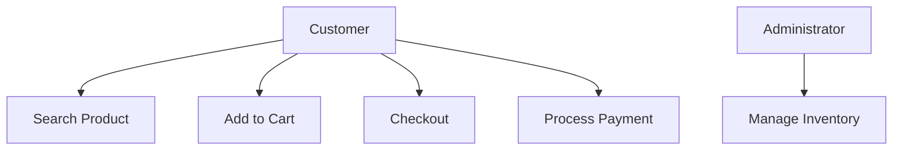

# Unified Modeling Language

## Introduction to Unified Modeling Language

The Unified Modeling Language (UML) stands as a cornerstone in the field of software engineering, known for its efficacy in modeling complex software systems. It is a standardized modeling language that provides a way to visualize a system's architectural blueprints, encompassing various types of diagrams and symbolic elements. To appreciate UML fully, it is essential to understand its evolution, its role in software engineering, and its fundamental components.

### The Evolution of UML
UML's journey began in the late 20th century, influenced by the need to consolidate a range of modeling methodologies that had emerged over the years.

1. **Early Modeling Methods**: Prior to UML, software engineering saw a variety of modeling methods, such as Entity-Relationship Diagrams (ERDs), used in database design, and flowcharts, which were common for algorithm representation. Other methods, like Booch method, Object-modeling Technique (OMT), and Object-oriented Software Engineering (OOSE), focused specifically on object-oriented design.

2. **The Convergence to UML**: The diversity in these methods often led to confusion and inefficiency, especially in large-scale and complex projects. Recognizing this, Grady Booch, Ivar Jacobson, and James Rumbaugh, known as the "Three Amigos," collaborated in the 1990s to integrate their respective methodologies (Booch method, OMT, and OOSE) into a unified approach. This effort culminated in the birth of UML, which was later adopted as a standard by the Object Management Group (OMG) in 1997.

### Importance of UML in Software Engineering
UML has become indispensable in the software development process, primarily due to its ability to aid in the visualization and documentation of software systems.

1. **Visual Representation**: UML's graphical nature makes it easier for developers to understand, design, and document complex software systems. It provides a visual language to represent the system architecture, workflows, data structures, and more, making it easier to communicate ideas and spot potential issues.

2. **Standardization**: As a standardized language, UML offers a consistent way of modeling systems, which is crucial for collaboration in large teams and across different organizations. This standardization ensures that UML diagrams are interpretable by anyone familiar with the language, irrespective of the specific tools used to create them.

### Overview of UML Components
At its core, UML is composed of diagrams and elements, each serving specific purposes in the modeling process.

1. **Diagrams**: UML includes several types of diagrams, each designed for modeling different aspects of a system. These include:

   - **Structural Diagrams**: Such as Class Diagrams, Object Diagrams, and Component Diagrams, which focus on the static aspects of the system.
   - **Behavioral Diagrams**: Including Use Case Diagrams, Sequence Diagrams, and Activity Diagrams, which depict the dynamic behavior of the system.
   - **Interaction Diagrams**: Like Sequence Diagrams and Communication Diagrams, which show how objects interact in particular scenarios.

2. **Elements**: The building blocks of UML diagrams include a variety of elements such as:

   - **Classes and Objects**: Representing entities with attributes and operations.
   - **Relationships**: Including associations, dependencies, generalizations, and realizations.
   - **Artifacts**: Representing physical components like files, documents, etc.
   - **Activities**: Denoting the workflow or processes.

In conclusion, UML serves as a universal language in software engineering, bridging gaps between conceptualization and implementation. Its comprehensive set of diagrams and elements provides a robust framework for effectively visualizing, designing, and documenting software systems, making it an essential skill for software professionals.

## UML Basics

Understanding the basics of the Unified Modeling Language (UML) is essential for anyone involved in software development. This foundational knowledge not only aids in visualizing the structure and design of a system but also enhances communication among team members. Here, we delve into the fundamentals of UML, including its diagrams, elements, symbols, notations, and the setup of UML tools.

### Understanding UML Diagrams
UML diagrams are categorized into two main types: Structural and Behavioral.

1. **Structural Diagrams**: These diagrams represent the static aspects of a system. Key structural diagrams include:
   - **Class Diagrams**: Show classes and their relationships.
   - **Object Diagrams**: Depict object instances of classes.
   - **Component Diagrams**: Illustrate the organization and dependencies among a set of components.
   - **Composite Structure Diagrams**: Detail the internal structure of classes.
   - **Deployment Diagrams**: Focus on the physical deployment of artifacts on nodes.
   - **Package Diagrams**: Display how a system is divided into packages.

2. **Behavioral Diagrams**: These diagrams model the dynamic behavior of the system and its objects. They include:
   - **Use Case Diagrams**: Represent the functionality provided by the system.
   - **Sequence Diagrams**: Show object interactions arranged in a time sequence.
   - **Activity Diagrams**: Depict the workflow from one activity to another.
   - **State Machine Diagrams**: Model the states and transitions of an entity.
   - **Communication Diagrams**: Focus on the interaction between objects.

### Basic Elements of UML
UML diagrams are composed of several basic elements:

1. **Classes and Objects**: Represent real-world entities with their attributes (properties) and operations (methods).
2. **Relationships**: Include various types like association, dependency, generalization, and aggregation, defining how elements are connected.
3. **Interfaces and Components**: Define system components and their interactions.
4. **Actors and Use Cases**: Specify system roles and functions.

### Symbols
Each UML diagram type utilizes specific symbols to represent various elements:

- **Classes**: Rectangles divided into compartments for name, attributes, and operations.
- **Interfaces**: Circles or lollipops.
- **Relationships**: Lines, arrows, and diamonds to denote associations, inheritances, or dependencies.
- **Actors**: Stick figures in use case diagrams.

### Notations
UML notations are a set of standardized rules to depict the information in diagrams:

- **Visibility Symbols**: Like + (public), - (private), and # (protected).
- **Multiplicity Notations**: Indicating the number of instances, like 1, *, 1..*.
- **Annotations**: Notes and constraints attached to elements.

### Setting Up UML Tools
UML diagrams can be created using various software tools, each offering different features.

1. **Software Options**:
   - **Enterprise-Level Tools**: Like Sparx Systems Enterprise Architect, offering advanced modeling capabilities.
   - **Open-Source Tools**: Such as StarUML or ArgoUML, which are free to use.
   - **Online Tools**: Including Lucidchart and Creately, providing cloud-based modeling solutions.

2. **Basic Setup Guide**:
   - **Choose a Tool**: Select a UML tool that suits your project's needs and budget.
   - **Installation**: For desktop applications, download and install the software. For online tools, create an account.
   - **Familiarization**: Get acquainted with the tool's interface and features.
   - **Template Selection**: Many tools offer templates for different UML diagrams.
   - **Creating Diagrams**: Start with simple diagrams like class or use case diagrams to get comfortable with the tool.
   - **Collaboration**: Explore features for sharing and collaborating on diagrams with team members.

In summary, grasping the basics of UML involves understanding its various diagrams, learning the symbols and notations used, and getting comfortable with a suitable UML tool. This foundational knowledge is crucial for effective software design and communication within development teams.

## Use Case Diagrams

Use Case Diagrams are a fundamental part of the Unified Modeling Language (UML) and play a critical role in the early stages of software development. They provide a user-oriented visualization of system functionality, making them crucial for understanding system requirements.

### Concept and Importance
- **Concept**: A Use Case Diagram is a graphical representation of the interactions between the users (actors) and the system to achieve specific goals. It focuses on the behavior of the system from an external point of view.
- **Importance**: These diagrams are essential because they:
   - **Facilitate Communication**: They provide a simple and intuitive way for stakeholders, including non-technical individuals, to engage in the system design process.
   - **Clarify Requirements**: Help in understanding and documenting functional requirements.
   - **Identify Actors and Use Cases**: Highlight all the users and the various ways they interact with the system.

### Elements of Use Case Diagrams
1. **Actors**: Represent users or external systems that interact with the system. Depicted as stick figures.
2. **Use Cases**: Illustrated as ovals, they represent the functions or services provided by the system.
3. **System Boundary**: A rectangle that frames the use cases, representing the scope of the system.
4. **Associations**: Lines connecting actors to use cases, showing interactions.
5. **Include and Extend Relationships**: Optionally used to show relationships between use cases, such as common functionalities or extensions.

### Creating a Use Case Diagram: Step-by-Step Guide
1. **Identify Actors**: Start by identifying all external entities that will interact with the system. These could be users, other systems, or hardware devices.
2. **Identify Use Cases**: List out all the functionalities or services that the system should provide to the actors.
3. **Draw the System Boundary**: Represent the system with a rectangle and place all identified use cases within this boundary.
4. **Connect Actors to Use Cases**: Use lines to connect each actor to the relevant use cases they interact with.
5. **Add Relationships (if necessary)**: Include 'include' or 'extend' relationships between use cases to represent shared functionalities or optional extensions.
6. **Refine and Review**: Ensure that the diagram represents all user interactions and review it with stakeholders for completeness and accuracy.

### Examples

#### Online Shopping System
- Actors: Customer, Administrator.
- Use Cases: Search Product, Add to Cart, Checkout, Process Payment, Manage Inventory (for Admin).
- Associations: Lines connecting the Customer to the first four use cases and the Administrator to 'Manage Inventory'.

### Library Management System
- Actors: Member, Librarian.
- Use Cases: Borrow Book, Return Book, Catalogue Book (Librarian), Pay Fines (Member).
- Associations: Member connected to Borrow, Return, and Pay Fines; Librarian to Catalogue Book.

Use Case Diagrams are invaluable for ensuring a mutual understanding of system functionalities between developers and stakeholders. They serve as a foundation for more detailed system design and are integral in the planning phases of a software project.

## Class Diagrams

Explain class diagrams, while discussing the following topics:
* Understanding Class Diagrams
* Components of Class Diagrams
* Classes
* Relationships
* Advanced Class Diagram Techniques

## Sequence Diagrams

Explain sequence diagrams, while discussing the following topics:
* Sequence Diagram Fundamentals
* Constructing Sequence Diagrams
* Advanced Concepts in Sequence Diagrams

## Activity Diagrams

Explain activity diagrams, while discussing the following topics:
* Basics of Activity Diagrams
* Developing Activity Diagrams
* Complex Scenarios in Activity Diagrams

## State Machine Diagrams

Explain state machine diagrams, while discussing the following topics:
* Introduction to State Machine Diagrams
* Building State Machine Diagrams
* Advanced State Modeling

## Component Diagrams

Explain component diagrams, while discussing the following topics:
* Component Diagram Overview
* Creating Component Diagrams
* Advanced Component Modeling

## Deployment Diagrams

Explain deployment diagrams, while discussing the following topics:
* Understanding Deployment Diagrams
* Constructing Deployment Diagrams
* Complex Deployment Scenarios

## Object Diagrams

Explain object diagrams, while discussing the following topics:
* Object Diagram Basics
* Creating Object Diagrams
* Advanced Object Diagram Techniques

## Composite Structure Diagrams

Explain composite structure diagrams, while discussing the following topics:
* Basics of Composite Structure Diagrams
* Developing Composite Structures
* Advanced Composite Structures

## Package Diagrams

Explain package diagrams, while discussing the following topics:
* Introduction to Package Diagrams
* Constructing Package Diagrams
* Advanced Packaging Techniques

## Profile Diagrams

Explain profile diagrams, while discussing the following topics:
* Understanding Profile Diagrams
* Creating Profile Diagrams
* Advanced Profiling

## Interaction Overview Diagrams

Explain interaction overview diagrams, while discussing the following topics:
* Basics of Interaction Overview
* Diagram Development
* Complex Interactions

## Timing Diagrams

Explain timing diagrams, while discussing the following topics:
* Timing Diagram Fundamentals
* Creating Timing Diagrams
* Advanced Timing Analysis

## UML and Software Development Processes

Explain UML and software development processes, while discussing the following topics:
* UML in Agile Development
* UML in Waterfall Model
* UML in DevOps

## UML Tools and Software

Explain UML tools and software, while discussing the following topics:
* Overview of UML Tools
* Comparison of UML Software
* Integrating UML Tools in Development

## Best Practices in UML

Explain best practices in UML, while discussing the following topics:
* UML Modeling Standards
* Avoiding Common Pitfalls
* Effective Communication with UML

## Advanced UML Topics

Explain advanced UML topics, while discussing the following topics:
* UML Extensions
* UML and Model-Driven Architecture
* UML in Emerging Technologies

## Case Studies and Real-World Examples

Explain case studies and real-world examples, while discussing the following topics:
* Case Study Analysis
* UML in Large Scale Projects
* Lessons Learned from Industry

## Glossary of Terms

Write a glossary of the top twenty terms used about UML.

## Frequently Asked Questions

Write a list of the top twenty frequently asked questions about UML and give a brief answer to each.
